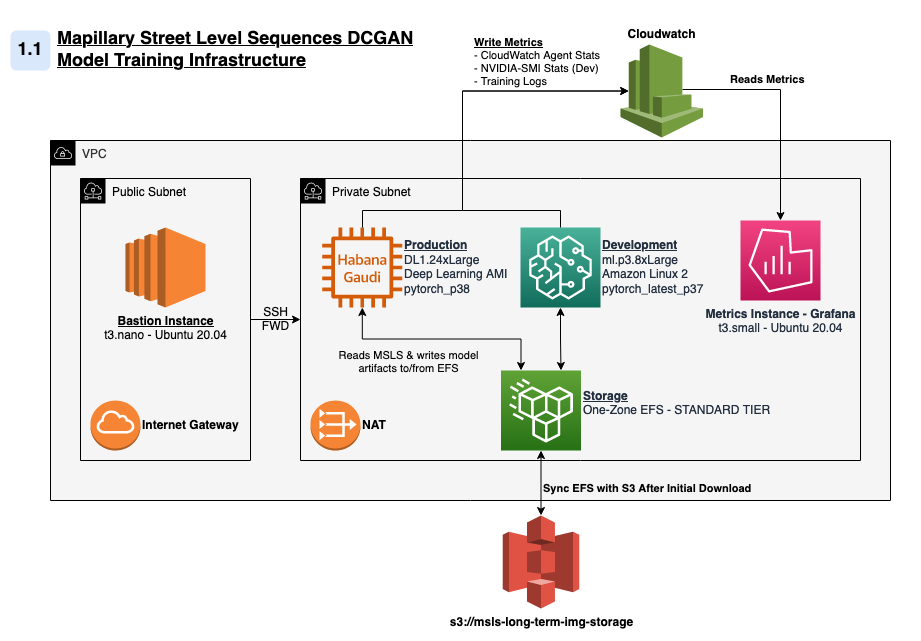

# About

This repository contains the AWS infrastructure used to train [msls-dcgan](https://github.com/DMW2151/msls-pytorch-dcgan). Generally, the architecture can be described by the image below:

<center>
    <figure class="image">
        
        <i><figcaption>Simplified System Architecture - DCGAN Training</figcaption></i>
    </figure>
</center>

**N.B: This repo does not download (nor provision pipelines to download) MSLS data, you may access it from your own signed URL [here](https://www.mapillary.com/dataset/places).**

## Usage

If you're so inclined, you can replicate the full architecure by running `terraform apply` from this repository. However, there are dozens of resources deployed by this configuration and I suspect your time would be better served by simply cloning `msls-dcgan` to a standalone Sagemaker (Testing, `P2` or `P3`) or EC2 (`DL1`) instance.

If you're resolute in your desire to run this precise architecture, please review the variable definitions in each of the modules and adjust accordingly.

In practice, only one of `train-model` or `train-model-dev` modules is run at a time, although if you're conscientious about stopping your instances, there's no reason both can't run simultaneously.

--------

### Core

- TBD

--------

### Development - Sagemaker P3.8xLarge

- TBD

--------

### Production - AWS Habana Deep Learning AMI - DL1.24xLarge

- TBD

--------

### Grafana

[Grafana](https://grafana.com/) is an open source analytics & monitoring solution that can be used to create charts from a variety of external data sources. A Grafana instance is not required to perform any model training or analysis, although many of the charts from my main post have been generated from the Grafana UI.

The module `stats-monitor` launches a Grafana instance in the core VPC and generates a `metrics_ip_addr`. Using this address and the `jump_ip_addr` from `mlcore`, a user can SSH tunnel the metrics instance UI to `localhost` with the following:

```bash
#! /bin/sh
ssh -L \
    127.0.0.1:3000:${INTERNAL_IP}:3000 \
    ubuntu@${JUMP_IP} \
    -i ${PATH_TO_KEY}
```

If this module is successful, you can navigate to `localhost:3000` in a browser and see the Grafana loign screen as below. Please refer to the Grafana 7.0.0 Docker [documentation](https://community.grafana.com/t/data-source-on-startup/8618) to understand how to begin using your Grafana distribution from there.

<center>
     <figure class="image">
        
        <figcaption>Grafana Login. Running in VPC, accessed via localhost:3000</figcaption>
    </figure>
</center>
